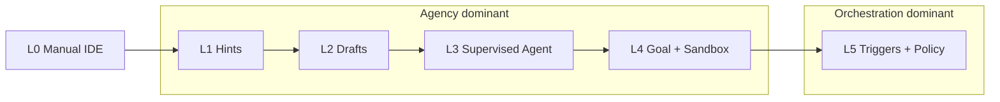

# Research Matrix: Addy Osmani L0–L5 Autonomy × AI Coding Products

**Date:** July 3, 2026  
**Framework source:** [AI-Assisted Engineering: A 2019 Perspective](https://addyosmani.com/blog/ai-assisted-engineering-idea/) (Addy Osmani)  
**Scope:** Closest product features in **Claude Code**, **OpenAI Codex**, **Cursor**, **Factory (Droid)**, and **Devin**

---

## Framework Definition (L0–L5)

| Level | Osmani definition | Human role | Control locus |
|-------|-------------------|------------|---------------|
| **L0** | No AI assistance — classic IDE only | Full manual control | Editor, terminal, VCS |
| **L1** | **Hints** — ranked completions, docs lookup, quick fixes, risk highlights | Conductor (in-the-moment) | Inline editor, diff annotations |
| **L2** | **Drafts** — multi-line suggestions, test stubs, migration snippets, commit messages | Conductor + editor | Inline suggestions, chat drafts, diff review |
| **L3** | **Complete tasks** E2E under human supervision (well-specified function/bug) | Supervised reviewer | Agent thread + per-action approval |
| **L4** | **Goal-driven** — coordinated task sequence, sandbox execution, verified changeset + evidence | Outcome reviewer | Goal/plan UI, sandbox policy, PR/diff summary |
| **L5** | **Co-stewardship** — monitors repos/production, files issues, opens safe maintenance PRs, explains trade-offs | Orchestrator / policy setter | Schedules, webhooks, org automations, observability hooks |

**Agency vs orchestration (used below):**
- **Agency** = a single agent executes work inside a session (edits, shell, browser) with permission gates.
- **Orchestration** = human or meta-layer coordinates *when* agents run, *what* triggers them, and *how* outcomes are routed (schedules, multi-agent, event pipelines).

> **Note:** Osmani also discusses an expanded 8-level “conductor → orchestrator” ladder in [Orchestrating Coding Agents (O'Reilly CodeCon 2026)](https://talks.addy.ie/oreilly-codecon-march-2026/). This matrix uses the original **L0–L5** taxonomy from his 2019 framing essay.

---

## Master Matrix

| Level | Product | Closest feature | Where control renders | Agency vs orchestration | Source |
|-------|---------|-----------------|----------------------|-------------------------|--------|
| **L0** | **Cursor** | Base VS Code editor with Tab/Agent disabled | Editor, terminal, status bar (Tab toggle) | Neither — human-only | [Tab completion](https://cursor.com/help/ai-features/tab) |
| **L0** | **Claude Code** | *(No native L0 — product is agent-first)* | N/A | **Weak/no embodiment** | [How Claude Code works](https://code.claude.com/docs/en/how-claude-code-works) |
| **L0** | **Codex** | *(No native L0 — agent-first)* | N/A | **Weak/no embodiment** | [Codex overview](https://developers.openai.com/codex) |
| **L0** | **Factory** | *(No native L0 — Droid CLI is agent-first)* | N/A | **Weak/no embodiment** | [Droid CLI Reference](https://docs.factory.ai/reference/cli-reference) |
| **L0** | **Devin** | *(No native L0 — cloud agent workspace)* | N/A | **Weak/no embodiment** | [Introducing Devin](https://cognitionai.mintlify.app/get-started/devin-intro) |
| **L1** | **Cursor** | **Tab** — inline ranked completions, cross-file jumps | Inline ghost text; status bar Tab control | **Agency (micro)** — model suggests; human accepts/rejects each hint | [Tab completion](https://cursor.com/help/ai-features/tab) |
| **L1** | **Cursor** | **Ask mode** — read-only codebase Q&A | Agent chat panel (`/ask`, `--mode=ask`) | **Agency (read-only)** — search/explain without edits | [Agent modes](https://cursor.com/help/ai-features/agent.md) |
| **L1** | **Claude Code** | **Plan mode** — read/explore without source edits | Terminal permission bar (`Shift+Tab` → `plan`); plan output | **Agency (read-only)** — exploration hints, not inline completion | [Permission modes](https://code.claude.com/docs/en/permission-modes) |
| **L1** | **Codex** | **Chat mode** + **`/plan`** — consultative, no workspace mutations | IDE sidebar / CLI TUI; `/permissions` read-only preset | **Agency (read-only)** — no Tab-style inline hints | [IDE features](https://developers.openai.com/codex/ide/features) · [Slash commands](https://developers.openai.com/codex/cli/slash-commands) |
| **L1** | **Factory** | **Spec Mode** — research & plan only, no edits/commands | CLI interaction mode (`Shift+Tab` → Spec); spec approval UI | **Agency (read-only)** — planning hints, not inline completion | [Autonomy Level / Spec Mode](https://docs.factory.ai/cli/user-guides/auto-run) |
| **L1** | **Devin** | Embedded IDE for **human takeover** during session | Devin Workspace IDE + Interactive Browser | **Weak L1** — human edits, not AI inline hints | [Devin intro](https://cognitionai.mintlify.app/get-started/devin-intro) |
| **L2** | **Cursor** | **Inline Edit** (`Cmd/Ctrl+K`) — targeted multi-line draft on selection | Inline prompt overlay on selected code | **Agency (draft)** — human approves each applied edit | [Inline edit](https://cursor.com/help/ai-features/inline-edit) |
| **L2** | **Cursor** | **Tab multi-line edits** — coordinated draft blocks + imports | Inline editor | **Agency (draft)** — keystroke-level acceptance | [Tab completion](https://cursor.com/help/ai-features/tab) |
| **L2** | **Claude Code** | **Default/`acceptEdits` mode** — generates patches on prompt; human reviews diffs | Terminal tool-approval prompts; diff in session | **Agency (draft→apply)** — supervised file edits | [Permission modes](https://code.claude.com/docs/en/permission-modes) |
| **L2** | **Codex** | **Chat mode** in IDE — draft answers/snippets without full agent loop | IDE composer (Chat vs Agent switcher) | **Partial L2** — drafts in chat, not persistent inline copilot | [IDE features](https://developers.openai.com/codex/ide/features) |
| **L2** | **Factory** | **Autonomy Low** — file create/edit drafts with low-risk command auto-run | CLI approval overlay (`Ctrl+E`); autonomy badge | **Partial L2/L3** — edits are task-scoped, not inline | [Autonomy Level](https://docs.factory.ai/cli/user-guides/auto-run) |
| **L2** | **Devin** | Session **planning phase** + PR description drafts | Devin chat + embedded IDE diff view | **Partial L2** — drafts emerge in agent workflow, not inline | [Devin intro](https://cognitionai.mintlify.app/get-started/devin-intro) |
| **L3** | **Cursor** | **Agent mode** — multi-file task execution with diff review | Agent panel; inline diff view; reject/accept edits | **Agency** — agent acts; human supervises diffs & tool calls | [Agent](https://cursor.com/help/ai-features/agent.md) |
| **L3** | **Cursor** | **Auto-review Run Mode** (default in 3.6+) — classifier gates shell/MCP/fetch | Run mode selector; `.cursor/permissions.json` rules | **Agency + policy** — fewer prompts, human sets allow/block rules | [LLM safety and controls](https://cursor.com/docs/enterprise/llm-safety-and-controls.md) |
| **L3** | **Claude Code** | **Default permission mode** — per-tool approval for edits/shell | Terminal permission prompts (`Shift+Tab` cycle) | **Agency (supervised)** — human approves each risky action | [Permission modes](https://code.claude.com/docs/en/permission-modes) |
| **L3** | **Claude Code** | **`acceptEdits` mode** — auto-approve workspace file edits | Status bar mode indicator; settings `permissions.defaultMode` | **Agency (supervised)** — human reviews outcome, not each edit | [Permission modes](https://code.claude.com/docs/en/permission-modes) |
| **L3** | **Codex** | **Agent mode + Auto preset** — workspace read/edit/run; approval on network/out-of-workspace | CLI `/permissions`; sandbox + approval policy UI | **Agency (supervised)** — OS sandbox + on-request approvals | [Agent approvals & security](https://developers.openai.com/codex/agent-approvals-security) |
| **L3** | **Codex** | **Cloud task from IDE** — delegate scoped task, review resulting diff/PR | Codex app / IDE “send to cloud” flow | **Agency (delegated)** — human assigns; agent runs remotely | [Codex cloud](https://developers.openai.com/codex/cloud) |
| **L3** | **Factory** | **Autonomy Medium** — deps install, build/test, local `git commit` auto-approved | CLI autonomy indicator (`Ctrl+L`); approval details (`Ctrl+E`) | **Agency (supervised)** — risk-tier gating | [Autonomy Level](https://docs.factory.ai/cli/user-guides/auto-run) |
| **L3** | **Devin** | **Normal permission mode** — prompts for writes & shell; conversational supervision | Devin Workspace terminal + IDE; permission prompts | **Agency (supervised)** — human watches/follows session | [Permissions](https://docs.devin.ai/cli/reference/permissions) |
| **L4** | **Cursor** | **Plan mode → Agent** — approve approach before multi-file execution | Plan UI in agent chat; `Shift+Tab` / `/plan` | **Agency → supervised handoff** — human approves plan, agent executes | [Agent modes](https://cursor.com/help/ai-features/agent.md) |
| **L4** | **Cursor** | **Cloud Agents** — goal in cloud VM, tests, artifacts, PR | Cloud dropdown; `cursor.com/agents`; PR + video/screenshot artifacts | **Agency (goal-driven)** — human sets task; agent verifies in sandbox VM | [Cloud Agents](https://cursor.com/docs/cloud-agent) |
| **L4** | **Claude Code** | **`/goal`** — persistent completion condition across turns; evaluator re-checks | Terminal `◎ /goal active` overlay; `/goal clear` | **Agency (goal-driven)** — separate evaluator decides “done” | [Keep Claude working toward a goal](https://code.claude.com/docs/en/goal) |
| **L4** | **Claude Code** | **`auto` permission mode** — classifier approves routine tool calls for long runs | Status bar `auto`; `autoMode` org config | **Agency (goal-driven)** — human sets goal/policy; agent runs longer stretches | [Auto mode config](https://code.claude.com/docs/en/auto-mode-config.md) |
| **L4** | **Claude Code** | **Subagents** (Explore, Plan, custom) — delegated parallel research/implementation | Subagent permission prompts; background subagent status | **Agency + light orchestration** — parent delegates sub-tasks | [Subagents](https://code.claude.com/docs/en/subagents) |
| **L4** | **Codex** | **`/goal` (Goal mode)** — persistent objective with pause/resume/clear | Composer goal chip above input | **Agency (goal-driven)** — human defines done; agent loops until met | [Prompting / Goal mode](https://developers.openai.com/codex/prompting) |
| **L4** | **Codex** | **Cloud threads** — parallel background tasks, verified PR output | Codex web; `@codex` on GitHub | **Agency (goal-driven)** — human delegates; cloud sandbox executes | [Codex cloud](https://developers.openai.com/codex/cloud) |
| **L4** | **Codex** | **Subagents** — explicit parallel delegation (`[agents]` in config) | CLI thread; subagent tool calls | **Agency + orchestration** — parent spawns specialized workers | [Customization / Subagents](https://developers.openai.com/codex/concepts/customization) |
| **L4** | **Factory** | **Autonomy High** — migrations, deploy scripts, `git push` (within allowlists) | CLI autonomy level; command allow/deny/block lists | **Agency (goal-driven)** — policy tables gate high-risk auto-run | [Autonomy Level](https://docs.factory.ai/cli/user-guides/auto-run) |
| **L4** | **Factory** | **Missions** — milestone plan → Mission Control orchestrates worker + validator agents | `/missions`; Mission Control overlay (`Ctrl+T`) | **Orchestration** — human approves plan; orchestrator delegates workers | [Factory Missions](https://docs.factory.ai/cli/features/missions) |
| **L4** | **Devin** | **Autonomous mode + OS sandbox** — auto-approve shell/fetch; sandbox bounds FS/network | CLI `--sandbox`; Autonomous permission mode | **Agency (goal-driven)** — sandbox replaces per-command human gate | [Permissions](https://docs.devin.ai/cli/reference/permissions) |
| **L4** | **Devin** | **Parallel managed Devins** — break large task into isolated VM sub-sessions | Advanced Capabilities in session; Devin MCP | **Orchestration** — parent Devin delegates to child sessions | [Advanced Capabilities](https://docs.devin.ai/work-with-devin/advanced-capabilities) |
| **L5** | **Cursor** | **Automations** — cron + GitHub/Slack/Linear/Sentry/PagerDuty triggers → Cloud Agent | `cursor.com/automations`; Agents window `/automate` | **Orchestration** — human defines triggers/instructions; agents run unattended | [Automations](https://cursor.com/docs/automations) |
| **L5** | **Cursor** | **Bugbot** — automatic PR review for bugs/security | GitHub PR integration | **Orchestration (reactive)** — monitors PRs; posts findings | [Agent / Bugbot](https://cursor.com/help/ai-features/agent.md) |
| **L5** | **Claude Code** | **Routines** — scheduled/API/GitHub-triggered cloud sessions | `claude.ai/code/routines`; `/schedule` in CLI | **Orchestration** — triggers + prompt define recurring co-stewardship | [Routines](https://code.claude.com/docs/en/routines) |
| **L5** | **Claude Code** | **GitHub Actions** (`claude-code-action`) — cron + PR/issue automation | `.github/workflows/*.yml`; `@claude` mentions | **Orchestration** — repo events drive unattended agent runs | [GitHub Actions](https://code.claude.com/docs/en/github-actions) |
| **L5** | **Claude Code** | **Hooks** — deterministic lifecycle automation (format, notify, gate) | `.claude/settings.json` hook config | **Orchestration (policy)** — encodes org discipline around agency | [Hooks guide](https://code.claude.com/docs/en/hooks-guide) |
| **L5** | **Codex** | **Standalone/project Automations** — recurring cloud/worktree runs → Triage inbox | Codex app Automations UI | **Orchestration** — schedule + skills; human reviews Triage findings | [Automations](https://developers.openai.com/codex/app/automations) |
| **L5** | **Codex** | **`codex exec` in CI** — scheduled fix pipelines on failed builds | GitHub Action `openai/codex-action`; cron in CI | **Orchestration** — event-driven unattended remediation | [Non-interactive mode](https://developers.openai.com/codex/noninteractive) |
| **L5** | **Factory** | **`droid exec --mission`** headless — multi-agent CI orchestration | CI pipeline invoking `droid exec --mission` | **Partial L5** — orchestration yes; weak prod monitoring / proactive issue filing | [Droid Exec / Mission mode](https://docs.factory.ai/cli/droid-exec/overview) |
| **L5** | **Devin** | **Automations** — Slack/GitHub/Linear/Schedule/Webhook triggers | Devin Automations UI; Team Settings | **Orchestration** — event-driven unattended sessions | [Automations](https://docs.devin.ai/product-guides/automations) |
| **L5** | **Devin** | **Auto-triage** — persistent Slack monitor spawns child investigation sessions | Slack channel monitor; shared scratchpad | **Orchestration (co-stewardship)** — closest to “proactively files/diagnoses issues” | [Auto-triage](https://docs.devin.ai/product-guides/auto-triage) |
| **L5** | **Devin** | **Observability automations** (Datadog/PagerDuty templates) — alert → investigate → PR | Automation templates + MCP integrations | **Orchestration (co-stewardship)** — production signal → agent response | [Datadog alert template](https://docs.devin.ai/automation-templates/datadog-alert-investigation) |
| **L5** | **Devin** | **Knowledge + Playbooks + Schedules** — org memory + recurring maintenance | Knowledge UI; Playbooks; Settings → Schedules | **Orchestration (co-stewardship)** — institutional policy drives recurring agent work | [Knowledge](https://docs.devin.ai/product-guides/knowledge) · [Scheduled Sessions](https://docs.devin.ai/product-guides/scheduled-sessions) |

---

## Weak / No Embodiment by Level

| Level | Overall product posture | Weakest products | Strongest products |
|-------|------------------------|------------------|-------------------|
| **L0** | Baseline non-AI IDE | Claude Code, Codex, Factory, Devin — **no meaningful L0** (AI-native) | Cursor (can disable Tab/Agent) |
| **L1** | Inline hints & passive assistance | Claude Code, Codex, Factory, Devin — **no Tab-style inline completion**; closest is read-only plan/ask/spec | **Cursor Tab + Ask** |
| **L2** | Draft-without-full-task-loop | Devin, Factory — drafts emerge inside agent sessions, not inline | **Cursor Inline Edit + Tab** |
| **L3** | Supervised task agent | All five have credible L3 (permission-gated agent sessions) | Rough parity |
| **L4** | Goal-driven verified work | Factory Missions still maturing (docs note open questions on parallelization/correctness) | Cursor Cloud Agents, Codex `/goal` + cloud, Claude `/goal` + auto, Devin sandbox autonomy |
| **L5** | Proactive co-stewardship | **Factory** — no first-class prod monitoring / auto-issue filing; Mission mode is project orchestration, not repo health | **Devin** (Auto-triage, observability automations, Knowledge) · **Cursor Automations** (Sentry/PagerDuty) · **Claude Routines/GitHub Actions** |

### L5 gap vs Osmani’s full vision

Osmani’s L5 explicitly includes **monitoring production environments** and **proactively filing issues**. No product fully closes that loop out of the box today:

| Capability | Cursor | Claude Code | Codex | Factory | Devin |
|------------|--------|-------------|-------|---------|-------|
| Scheduled repo maintenance | ✅ Automations | ✅ Routines | ✅ Automations | ⚠️ `droid exec` only | ✅ Schedules/Automations |
| Event-driven incident response | ✅ Sentry/PagerDuty triggers | ⚠️ GitHub-centric | ⚠️ Limited | ❌ | ✅ Datadog/PagerDuty/Slack |
| Proactive issue filing | ⚠️ Via integrations | ⚠️ Via GitHub | ⚠️ Triage inbox | ❌ | ✅ Auto-triage + Linear |
| Production environment monitoring | ❌ (repo-centric) | ❌ | ❌ | ❌ | ⚠️ Via MCP (Datadog etc.) |
| Safe automated maintenance PRs | ✅ Cloud Agent PRs | ✅ GitHub Action PRs | ✅ Cloud PRs | ⚠️ `--auto high` in CI | ✅ Playbook-driven PRs |

---

## Agency → Orchestration Progression (cross-product)

**Representative control-surface shift:**

| Transition | What moves | Example |
|------------|-----------|---------|
| L1→L3 | Inline accept/reject → thread-level supervision | Cursor Tab → Agent + Auto-review |
| L3→L4 | Per-action gates → goal/sandbox/completion criteria | Claude default → `/goal` + `auto` |
| L4→L5 | Session goals → external triggers & org policy | Codex `/goal` → Standalone Automations + Triage |

---

## Product Snapshots (July 2026)

### Cursor — strongest L1–L2, competitive L4–L5
- **L1–L2:** Tab, Inline Edit, Ask — control renders **in-editor**.
- **L3–L4:** Agent, Plan, Cloud Agents — control in **agent panel + diff view + cloud dashboard**.
- **L5:** Automations with Sentry/PagerDuty — control in **`cursor.com/automations`** (orchestration layer).

### Claude Code — skips L1–L2; strong L3–L5 via terminal + cloud
- **L1–L2:** **Weak** — terminal agent, not inline copilot.
- **L3–L4:** Permission modes, `/goal`, subagents — control in **terminal status bar + overlays**.
- **L5:** Routines, GitHub Actions, hooks — control in **claude.ai/code/routines + CI YAML**.

### OpenAI Codex — agent-first; `/goal` bridges L3→L4; Automations for L5
- **L1–L2:** **Weak** — Chat/`/plan` only; no Tab autocomplete.
- **L3–L4:** Sandbox + approvals, `/goal`, cloud threads, subagents.
- **L5:** App Automations + `codex exec` CI — control in **Codex app + Triage inbox**.

### Factory (Droid) — explicit autonomy tiers; Missions = L4 orchestration; thin L5
- **L1–L2:** **Weak** — Spec Mode is planning, not inline drafts.
- **L3–L4:** Autonomy Off→High; Missions with Mission Control.
- **L5:** **Weakest** — headless `--mission` / exec in CI; no native prod monitoring story.

### Devin — weakest L0–L2; strongest L5 co-stewardship story
- **L1–L2:** **Weak** — cloud agent workspace, not inline copilot.
- **L3–L4:** Normal → Autonomous sandbox; parallel managed Devins.
- **L5:** **Strongest** — Auto-triage, observability automation templates, Knowledge/Playbooks, Automations.

---

## Methodology & Caveats

1. **Mapping is approximate.** Osmani’s levels describe *posture*, not 1:1 product SKUs. Several features span levels (e.g., Cursor Plan sits at L1 read-only and L4 goal approval).
2. **Sources prioritized:** Official docs (`code.claude.com`, `developers.openai.com`, `cursor.com/docs`, `docs.factory.ai`, `docs.devin.ai`) and Osmani’s primary essay. Secondary synthesis (e.g., Swarmia blog on the same taxonomy) was used for framing only.
3. **Date sensitivity:** Feature names evolve (Cursor “Background Agents” → “Cloud Agents”; Devin “Scheduled Sessions” → “Automations recommended”). URLs reflect July 2026 docs state.
4. **Enterprise overlays** (managed permission rules, sandbox enforcement, org max autonomy) shift *where* control renders (admin dashboard vs developer UI) without changing the underlying level mapping.

---

## Key Sources

| Source | URL |
|--------|-----|
| Osmani L0–L5 framework | https://addyosmani.com/blog/ai-assisted-engineering-idea/ |
| Osmani orchestration talk (8-level extension) | https://talks.addy.ie/oreilly-codecon-march-2026/ |
| Claude Code permissions / goal / routines | https://code.claude.com/docs/en/permission-modes · https://code.claude.com/docs/en/goal · https://code.claude.com/docs/en/routines |
| Codex security / goal / automations | https://developers.openai.com/codex/agent-approvals-security · https://developers.openai.com/codex/prompting · https://developers.openai.com/codex/app/automations |
| Cursor agent / cloud / automations | https://cursor.com/help/ai-features/agent.md · https://cursor.com/docs/cloud-agent · https://cursor.com/docs/automations |
| Factory autonomy / missions | https://docs.factory.ai/cli/user-guides/auto-run · https://docs.factory.ai/cli/features/missions |
| Devin permissions / automations / auto-triage | https://docs.devin.ai/cli/reference/permissions · https://docs.devin.ai/product-guides/automations · https://docs.devin.ai/product-guides/auto-triage |

[REDACTED]