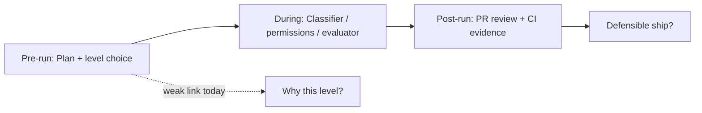

# Verification & Defensibility in Agentic Coding Products

*Research snapshot — July 3, 2026. Synthesized from official docs, product blogs, and practitioner write-ups.*

---

## Framing: Addy Osmani's question

The user-cited formulation — *"what level does this task deserve, and what verification makes that level defensible?"* — aligns with Addy Osmani's published harness philosophy, though the exact sentence does not appear verbatim in his indexed posts. His closest published articulation:

> "Verification as a hard exit criterion. Make 'produce evidence' the exit step of every task… Evidence is whatever proves the work is done: a green test run, a screenshot, a log, a review approval. Without it, the task is not done. 'Seems right' never closes the loop."
> — [Agent Skills](https://addyosmani.com/blog/agent-skills/)

He also references **Cursor's planner/worker/judge split** as an example of separating generation from completion signal, and describes autonomy as a **dial set by blast radius**, not guilt — in [Agentic Code Review](https://addyosmani.com/blog/agentic-code-review/).

**Core insight for this research:** shipping products split verification across three phases — **pre-run posture** (plan + autonomy choice), **during-run governance** (classifiers, permission modes, checkpoints), and **post-run evidence** (PR review, CI, Bugbot). Almost none connect all three explicitly before Send.

---

## Lifecycle map

| Phase | What "verification" means here | Primary product patterns |
|---|---|---|
| **Before Send** | Is the approach right? Is this autonomy level justified? What proof will close the task? | Plan Mode, plan approval dialogs, `/goal` prose, ExecPlans |
| **During run** | Are individual actions safe/aligned? Is progress toward the stopping condition real? | Auto-review, permission modes, evaluators, checkpoints |
| **After run** | Can we defend merging/shipping? | Bugbot, Codex `/review`, GitHub checks, human review |

---

## Before run

### Cursor Plan Mode

- **Mechanism:** Read-only planning → clarifying questions → editable markdown plan → explicit **Build** click. ([Plan Mode docs](https://cursor.com/docs/agent/plan-mode), [intro blog](https://cursor.com/blog/plan-mode))
- **Verification posture:** Human reviews *approach* and can add test/validation todos manually; docs recommend refining plans and adding verification steps, but the product does not require them. ([practitioner guide](https://engincanveske.substack.com/p/how-i-use-cursor-plan-mode-for-real))
- **Autonomy coupling:** Weak. Plan Mode is orthogonal to Agent vs. Auto-review settings. No UI asks "why Agent vs. Plan?" or ties Build to a verification contract.
- **Auto-suggest:** Cursor suggests Plan Mode for complex tasks (keyword heuristics), but does not explain *why* or prescribe verification depth.

### Claude Code — Plan Mode + 5-option approval dialog

**Strongest pre-run → execution-level coupling in the market.**

| Step | Behavior | Source |
|---|---|---|
| Plan (read-only) | Research, `/plan`, `Shift+Tab`; no source edits | [Permission modes](https://code.claude.com/docs/en/permission-modes) |
| Plan review | Edit in-editor (`Ctrl+G`), inline comments in VS Code | [Permission modes](https://code.claude.com/docs/en/permission-modes) |
| Approval dialog | 5 options when plan is ready | [Permission modes](https://code.claude.com/docs/en/permission-modes) |

**Approval options (plan → execution autonomy):**

1. **Approve and start in auto mode** → switches to `auto` (classifier-governed, minimal prompts)
2. **Approve and accept edits** → `acceptEdits`
3. **Approve and review each edit manually** → `default`
4. **Keep planning with feedback**
5. **Refine with Ultraplan** (browser-based review)

This is the clearest shipping pattern where **pre-run review explicitly selects post-approval permission level**. The product does not, however, auto-recommend which option fits the task or require verification prose in the plan.

**Six permission modes** (baseline, not plan-specific): `default`, `acceptEdits`, `plan`, `auto`, `dontAsk`, `bypassPermissions` — each defines what runs without asking. ([Permission modes](https://code.claude.com/docs/en/permission-modes))

### Codex — `/plan`, PLANS.md, and `/goal` contract

Codex separates **exploration** from **execution contract**:

| Command/artifact | Role | Verification connection |
|---|---|---|
| `/plan` | Read-only scoping; clarifying questions; Shift+Tab through Plan → Pair → Execute | Pre-implementation review; prompt-level constraint, not runtime sandbox ([planning guide](https://codex.danielvaughan.com/2026/03/27/planning-mode-in-practice/)) |
| `PLANS.md` / ExecPlan | Multi-hour auditable spec; "show how to prove that the work is done" | User-authored verification surface ([ExecPlans cookbook](https://developers.openai.com/cookbook/articles/codex_exec_plans)) |
| `/goal` | Persisted completion contract: outcome + how to check + constraints + budget | **Strongest verifiable end-state prose** — user must write measurable stopping conditions ([Goals cookbook](https://developers.openai.com/cookbook/examples/codex/using_goals_in_codex), [use case](https://developers.openai.com/codex/use-cases/follow-goals)) |

Codex `/goal` lifecycle states: `pursuing`, `paused`, `achieved`, `unmet`, `budget-limited`. Completion requires a **requirement-by-requirement audit** against files, tests, command output — encoded in the continuation prompt template. ([GitHub: continuation.md](https://github.com/openai/codex/blob/main/codex-rs/prompts/templates/goals/continuation.md))

**Recommended composition:** `/plan` first → promote to `/goal` with explicit verification commands. ([Build Great Products guide](https://www.buildgreatproducts.com/guides/codex-cli-goal))

### Other pre-run patterns

| Product | Pattern | Verification link |
|---|---|---|
| **Windsurf Cascade** | Plan → markdown plan → **Implement** | User adds validation rules in `.windsurfrules`; autonomy is separate (`auto` / `suggest` / `manual`) ([Cascade modes](https://docs.windsurf.com/windsurf/cascade/modes)) |
| **Devin** | Interactive Planning; 30s auto-proceed or "Wait for my approval" | Plan citations for human verification before execution ([Devin docs](https://docs.devin.ai/work-with-devin/interactive-planning)) |
| **Ona** | Plan → `spec.md` → Build (`Cmd+Shift+Enter`) | Structured spec approval ([Ona docs](https://ona.com/docs/llms-full.txt)) |
| **Magentic-UI** | Co-planning + action-guard policy (`always` / `auto-conservative` / `auto-permissive`) | Pre-execution plan edit; irreversibility heuristics + LLM judge ([MS Research blog](https://www.microsoft.com/en-us/research/blog/magentic-ui-an-experimental-human-centered-web-agent/)) |
| **Addy Agent Skills** | `/spec` → `/plan` → `/build`; every task needs acceptance criteria + verification step | Workflow enforcement, not IDE UI ([planning skill](https://github.com/addyosmani/agent-skills/blob/main/skills/planning-and-task-breakdown/SKILL.md)) |

---

## During run

### Cursor Auto-review (~7% interruption rate)

**Classification: governance dial + selective gate — not correctness verification.**

| Metric | Value | Source |
|---|---|---|
| Classifier block rate | ~4% of reviewed actions | [Auto-review blog](https://cursor.com/blog/agent-autonomy-auto-review) |
| Chats with ≥1 user interruption | ~7% (down from ~40% pre-auto-review) | [Auto-review blog](https://cursor.com/blog/agent-autonomy-auto-review) |
| Default | On for new users | [Auto-review blog](https://cursor.com/blog/agent-autonomy-auto-review) |

**Three-stage pipeline:** allowlist → sandbox → contextual classifier. ([SDK guide](https://startdebugging.net/2026/06/gate-cursor-sdk-tool-calls-with-auto-review-and-permissions-json/))

**What it verifies:** *intent alignment + consequence of being wrong + context* — not "did tests pass?" When blocked, ~most cases the parent agent self-corrects without user prompt; only some blocks become human interruptions. ([Auto-review blog](https://cursor.com/blog/agent-autonomy-auto-review))

**Verdict:** Auto-review is **during-run risk governance**, analogous to Claude Code `auto` mode's classifier. It makes higher autonomy *safer*, not *defensible by evidence*. It does not answer Addy's verification question — it reduces approval fatigue while catching high-consequence misalignment.

### Claude Code — `/goal` evaluator + Auto mode classifier

| Mechanism | Evaluates | Limitation |
|---|---|---|
| **`/goal` Stop-hook evaluator** (Haiku default) | User-written condition against **conversation transcript only** | Does not run tools independently; condition must be provable from surfaced output ([Goal docs](https://code.claude.com/docs/en/goal)) |
| **`auto` mode classifier** | Whether action escalates beyond request, targets unknown infra, hostile content | Research preview; reduces prompts, not proof of correctness ([Permission modes](https://code.claude.com/docs/en/permission-modes)) |

**Complementary pair:** `auto` removes per-tool prompts; `/goal` removes per-turn "are we done?" prompts. Evaluator returns yes/no + short reason each turn.

**Known failure mode:** Subjective or non-observable conditions loop until turn cap — docs mandate `or stop after N turns`. ([Goal docs](https://code.claude.com/docs/en/goal))

### Codex `/goal` during-run loop

- Thread-scoped state survives restarts; token/wall-clock budgets → `budget-limited` with wrap-up steering. ([18-hour run write-up](https://pub.towardsai.net/i-walked-away-from-openais-new-codex-goal-for-18-hours-it-shipped-14-of-18-features-solo-a280f8407707))
- Progress reports should name checkpoint, **what was verified**, what remains, blockers. ([Follow goals use case](https://developers.openai.com/codex/use-cases/follow-goals))
- **Gap:** Plan mode can silently suppress `/goal` continuation until plan approved (no notification). ([Towards AI](https://pub.towardsai.net/i-walked-away-from-openais-new-codex-goal-for-18-hours-it-shipped-14-of-18-features-solo-a280f8407707))

### Claude Code checkpointing (Esc Esc / `/rewind`)

**Recovery mechanism, not verification** — but essential for defensibility when autonomy overshoots.

- Double-`Esc` (empty input) or `/rewind` → restore code, conversation, or both per checkpoint. ([Checkpointing docs](https://code.claude.com/docs/en/checkpointing))
- Checkpoints capture **file edits via editing tools only** — bash `rm`/`mv`/`cp` not tracked. ([Checkpointing docs](https://code.claude.com/docs/en/checkpointing))
- Persists across session resume (~30 days configurable).

**Role in verification posture:** rollback safety net that lets users grant higher during-run autonomy knowing they can rewind — but it is not evidence of correctness.

---

## After run

### Cursor Bugbot

- Async PR/MR review; inline comments; GitHub/GitLab **status check** (`Cursor Bugbot`). ([Bugbot docs](https://cursor.com/docs/bugbot))
- Pre-push: `/review-bugbot` skill reviews branch diff before push (Cursor 3.7+). ([Bugbot docs](https://cursor.com/docs/bugbot))
- **Autofix (beta):** spawns Cloud Agent to fix findings. ([Building Bugbot](https://cursor.com/blog/building-bugbot))
- **Future:** run code to verify its own bug reports. ([Building Bugbot](https://cursor.com/blog/building-bugbot))
- Custom rules via `.cursor/BUGBOT.md`; 70%+ of flags resolved before merge (marketing claim). ([Bugbot product page](https://cursor.com/bugbot))

### Codex auto-review (GitHub + CLI)

| Surface | Trigger | Focus |
|---|---|---|
| **GitHub** | Auto on PR open or `@codex review`; `@codex fix it` for fixes | P0/P1 only; follows `AGENTS.md` Review guidelines ([GitHub integration](https://developers.openai.com/codex/integrations/github)) |
| **CLI `/review`** | Pre-push local review | Can execute locally; "before co-workers see it" ([OpenAI verification post](https://alignment.openai.com/scaling-code-verification/)) |

OpenAI internal/external stats: ~52.7% of reviewer comments lead to code changes; 100k+ external PRs/day. Agentic reviewer with repo-wide tools + execution access. ([Scaling code verification](https://alignment.openai.com/scaling-code-verification/))

### GitHub PR checks (platform layer)

Neither Cursor nor Codex replaces CI — they **integrate as checks**:

- Bugbot → GitHub check run
- Codex → standard GitHub review
- Cursor Team Kit `review-and-ship` skill explicitly runs `gh pr checks` before ship. ([review-and-ship skill](https://github.com/cursor/plugins/blob/main/cursor-team-kit/skills/review-and-ship/SKILL.md))

**Post-run defensibility stack:** agent review (advisory) + deterministic CI (lint, typecheck, tests) + human review on load-bearing paths — matching Addy's "proof over vibes." ([Code review AI post](https://addyosmani.com/blog/code-review-ai/))

### Cursor `/verify-this` skill (during → post boundary)

Team Kit skill: baseline evidence, treatment evidence, commands run, verdict — stops "looks done" before review. ([Eric Zakariasson on Team Kit](https://www.linkedin.com/posts/ericzakariasson_most-of-the-skills-we-use-at-cursor-started-activity-7462566566606499840-e4Ha)) — skill/workflow layer, not first-class product UI.

---

## Comparative matrix

| Product | Pre-run plan review | Level ↔ verification coupling | During-run gate | Stopping condition / evidence | Post-run evidence | "Why this level?" before Send |
|---|---|---|---|---|---|---|
| **Cursor Plan Mode** | ✅ Strong | ❌ Weak | Auto-review (risk, not proof) | User-added plan todos | Bugbot, `/review-bugbot`, CI | ❌ |
| **Claude Code Plan + approval** | ✅ Strong | ✅ **Strongest** (5 options → permission mode) | Auto classifier + optional `/goal` evaluator | User `/goal` prose; evaluator on transcript | Human + git | ❌ |
| **Codex `/plan` + `/goal`** | ✅ Strong | ⚠️ Medium (user writes contract) | Budget + completion audit prompt | ✅ **Strongest verifiable end-state prose** | `/review`, GitHub, CI | ❌ |
| **Windsurf Plan → Implement** | ✅ | ⚠️ Autonomy settings separate | Confirm / suggest / auto | `.windsurfrules` validation | Standard CI | ❌ |
| **Devin Interactive Planning** | ✅ | ⚠️ Optional wait-for-approval | Permission rules + hooks | Runs tests in session | PR + human | ❌ |
| **Magentic-UI** | ✅ Co-plan | ⚠️ Action-guard policy | Irreversibility + LLM judge | Answer verification (research) | Human | ❌ |
| **Addy Agent Skills** | ✅ Workflow | ✅ In skill text (acceptance criteria per task) | Anti-rationalization tables | Hard exit = evidence | `/review`, `/ship` | ❌ (framework, not product) |

---

## Answers to the three questions

### 1. Do any products help users answer *"is this autonomy level defensible for THIS task"* before Send?

**No product does this comprehensively today.** The gap is consistent:

- Products **suggest** Plan Mode for complexity (Cursor, Windsurf) or let you **choose** permission mode (Claude Code) — but none analyze *this specific task* and say: *"Level 2 is appropriate because X; you need tests Y and human review on Z."*
- Closest partial answers:
  - **Claude Code plan approval dialog** — forces an explicit autonomy choice *after* plan review, but doesn't justify the choice or tie it to verification requirements.
  - **Codex `/goal`** — user must write defensible stopping conditions upfront; product enforces the contract during run, but doesn't recommend the contract.
  - **Addy Agent Skills / Swarmia taxonomy / CSA autonomy levels** — conceptual frameworks; not integrated pre-Send UI.
  - **Magentic-UI action guards** — user configures approval policy; LLM judge for "maybe irreversible" actions — closer to *risk* than *task-appropriate autonomy*.

### 2. What's the closest shipping pattern to pre-run verification posture?

**Winner: Claude Code Plan Mode + 5-option approval dialog.**

Why it leads:
1. **Hard separation** of thinking (read-only plan) from doing (execution permission mode).
2. **Explicit Build equivalent** that is also an **autonomy selector** — approve into `auto`, `acceptEdits`, or `default`.
3. **Editable plan artifact** before dispatch (`Ctrl+G`, inline comments).
4. Composable with **`/goal`** for during-run verifiable stopping conditions.

**Runner-up: Codex `/plan` → `/goal` with ExecPlan/PLANS.md** — stronger on *what evidence proves done*, weaker on tying that to a permission/autonomy dial in one UI moment.

**Cursor Plan Mode** matches steps 1–3 but lacks step 2's autonomy coupling; verification is opt-in manual plan editing.

### 3. How do products connect level selection to verification requirements?

| Connection pattern | Example | Strength |
|---|---|---|
| **Plan approval → permission mode** | Claude Code: approve plan → pick auto / acceptEdits / manual | Explicit level selection; verification not bundled |
| **Goal prose = verification contract** | Codex `/goal`, Claude `/goal` | Verification requirements *are* the stopping condition; level is implicit (high if unattended `/goal`) |
| **Mode stack (explore → pair → execute)** | Codex Plan / Pair / Execute | Level is mode; verification is user-authored in goal or AGENTS.md |
| **Classifier as autonomy dial** | Cursor Auto-review, Claude `auto` | Low-level actions auto-approved; high-consequence escalates — **risk governance**, not task-appropriate level |
| **Post-hoc evidence chain** | Bugbot + CI + `/review` | Verification after autonomy was already granted |
| **Skills/hooks as enforcement** | Addy skills, Cursor hooks (`beforeSubmitPrompt`, `stop`) | Team-defined coupling; not product-default |

**The missing product pattern:** a pre-Send card that shows:
- Recommended autonomy level (with rationale: blast radius, files touched, reversibility)
- Required verification artifacts for that level (tests, manual check, PR review, Bugbot)
- User confirms or downgrades before dispatch

No major shipping IDE/agent product exposes this as first-class UI yet.

---

## Implications for agentic UX design (eve-chat context)

1. **Treat verification and governance as separate surfaces.** Auto-review/classifiers answer *"should this action run?"* Evaluators and CI answer *"is the task done correctly?"* Conflating them confuses users.

2. **The strongest pre-run primitive is plan approval that also selects execution posture** — Claude Code's dialog is the reference interaction. Cursor Plan Mode's "Build" is halfway there.

3. **Verifiable end-state prose belongs in the dispatch contract** — Codex `/goal` and Claude `/goal` show that user-authored measurable conditions + separate evaluator model is the emerging pattern for unattended runs.

4. **Recovery ≠ verification** — Esc Esc/checkpoints enable higher autonomy by reducing rollback cost; they don't produce ship-ready evidence.

5. **Post-run is where defensibility actually lands** — Bugbot, Codex review, and GitHub checks are the audit trail. Pre-run should *declare* which of these will be required, not assume them.

6. **Opportunity gap:** No product explains *why* a level is appropriate before Send. That is the highest-leverage UX surface for Addy's question — connecting blast radius → autonomy level → verification checklist in one pre-dispatch moment.

---

## Key sources

| Topic | URL |
|---|---|
| Cursor Plan Mode | https://cursor.com/docs/agent/plan-mode |
| Cursor Auto-review | https://cursor.com/blog/agent-autonomy-auto-review |
| Cursor Bugbot | https://cursor.com/docs/bugbot |
| Claude Code permission modes + plan approval | https://code.claude.com/docs/en/permission-modes |
| Claude Code `/goal` | https://code.claude.com/docs/en/goal |
| Claude Code checkpointing | https://code.claude.com/docs/en/checkpointing |
| Codex Goals cookbook | https://developers.openai.com/cookbook/examples/codex/using_goals_in_codex |
| Codex follow goals | https://developers.openai.com/codex/use-cases/follow-goals |
| Codex GitHub review | https://developers.openai.com/codex/integrations/github |
| OpenAI code verification at scale | https://alignment.openai.com/scaling-code-verification/ |
| Addy Osmani Agent Skills | https://addyosmani.com/blog/agent-skills/ |
| Windsurf Cascade modes | https://docs.windsurf.com/windsurf/cascade/modes |
| Devin Interactive Planning | https://docs.devin.ai/work-with-devin/interactive-planning |
| Magentic-UI | https://arxiv.org/html/2507.22358v1 |

[REDACTED]